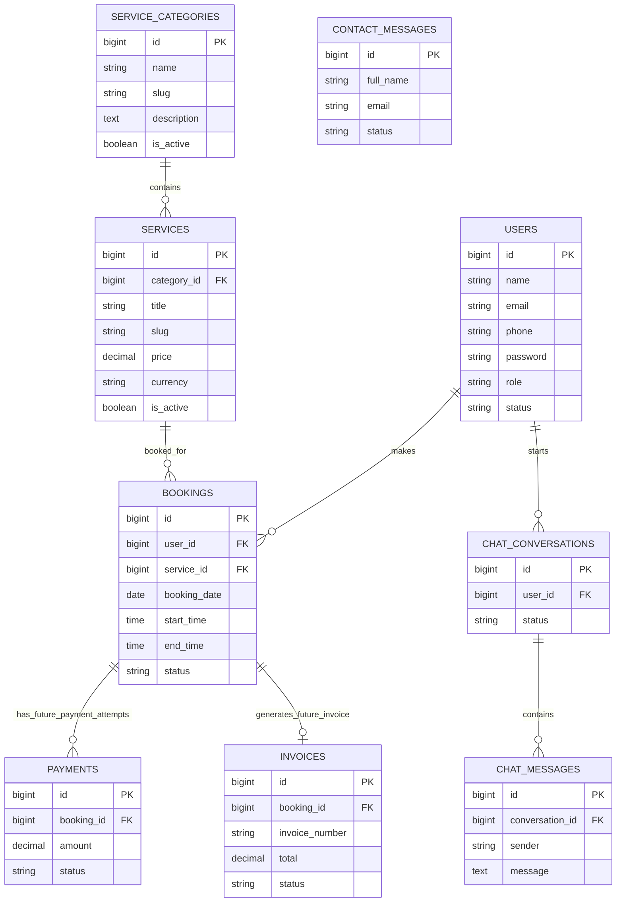

# Database Schema

Authoritative source: `PR_Per_Hour_SQL.txt` (client-supplied).

This document describes the **exact** nine domain tables. It does not propose additional tables.

## Domain tables

1. `users`
2. `service_categories`
3. `services`
4. `bookings`
5. `payments` (future-ready schema only)
6. `invoices` (future-ready schema only)
7. `chat_conversations`
8. `chat_messages`
9. `contact_messages`

Framework tables that may also exist (not client domain schema):

- `personal_access_tokens` (Sanctum)
- `password_reset_tokens`, `sessions`, `cache`, `jobs` (Laravel defaults)

## Column summary

| Table | Columns |
| --- | --- |
| users | id, name, email, phone, password, role, status, created_at, updated_at, deleted_at |
| service_categories | id, name, slug, description, is_active, created_at, updated_at, deleted_at |
| services | id, category_id, title, slug, description, duration_minutes, price, currency, is_active, created_at, updated_at, deleted_at |
| bookings | id, user_id, service_id, booking_date, start_time, end_time, status, notes, meeting_link, created_at, updated_at, deleted_at |
| payments | id, booking_id, amount, currency, payment_method, transaction_id, status, paid_at, created_at, updated_at, deleted_at |
| invoices | id, booking_id, invoice_number, total, currency, status, issued_at, paid_at, created_at, updated_at, deleted_at |
| chat_conversations | id, user_id, visitor_name, visitor_email, status, created_at, updated_at, deleted_at |
| chat_messages | id, conversation_id, sender, message, created_at, updated_at |
| contact_messages | id, full_name, email, phone, organization, message, status, created_at, updated_at, deleted_at |

## ERD

## Notes

- Status/role fields are `VARCHAR` in MySQL; PHP enums are application casts only.
- Soft deletes exist only where `deleted_at` is present (`chat_messages` has none).
- See [CLIENT_SCHEMA_PARITY.md](CLIENT_SCHEMA_PARITY.md).
